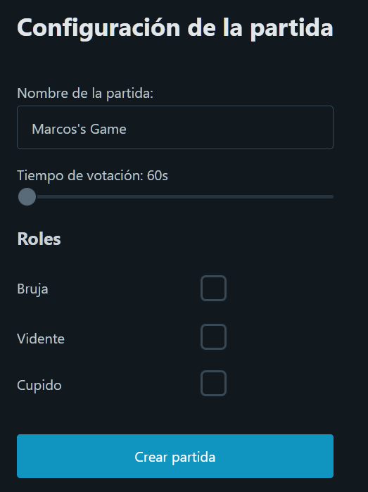
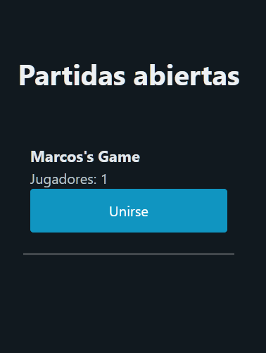
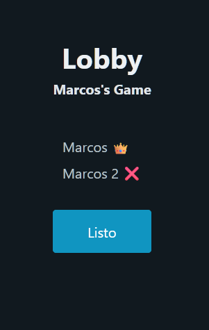
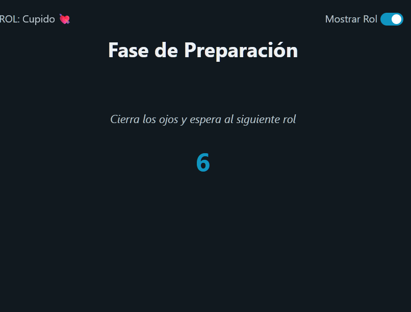

# Description
This app is a recreation of the original card game "El pueblo duerme" or "Mafia" in english. It was made using Node.js + Svelte as frontend and Next.js + Sockets.io as backend.
The game is full in spanish, with no plans of traducing it to other languages.

You can try to play with your friends at [https://el-pueblo-duerme.vercel.app/](https://el-pueblo-duerme.vercel.app/)

# Create a new game

In the create game screen, you can choose the name of the game (used by displaying it in the game list selector), the amount of time you want for the voting phase and the roles you want to have for that game.

# Joining a game

If you want to join a friend's game, go to "Join game" and select your friend's game name.

# The lobby

Here, all the players will wait until you reach the minimun number of players (8) and everyone clicks they are ready. Then, the Lobby Master (the one who created the game and has the crown) can click on "Start game" to proceed.

# The game Screen

In the game screen, you will always have your role in the top left corner. You can hide it by pressing the toggle in the top right corner.

Role to role, you will be hearing a voice advertising what the players must do:
"The wolfs awakens...", "The Witch awakens...", e.t.c

Until your role comes, you must be waiting with your eyes closed. (There is a special event when everybody must awake to know if they have a lover).

# The voting screen